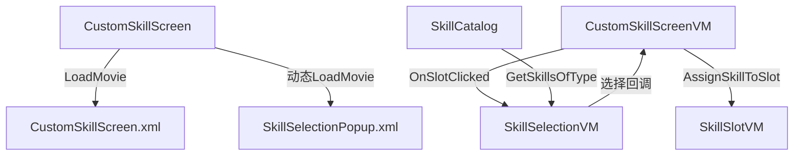

## 产品概述

为New_ZZZF模组的技能配置界面添加技能选择功能，使玩家能够点击技能槽位打开选择弹窗，从符合条件的技能列表中选取技能并分配到槽位。

## 核心功能

- 点击技能槽位打开技能选择弹窗
- 弹窗显示符合槽位类型的技能列表（主主动/副主动/被动/战技/法术）
- 支持搜索过滤技能名称
- 选择技能后分配到对应槽位并标记脏数据
- 支持取消选择关闭弹窗

## 技术栈

- GauntletUI框架（XML布局 + ViewModel数据绑定 + ScreenBase图层管理）
- TaleWorlds.Library（ViewModel, MBBindingList, PropertyChanged）
- C# .NET Framework 4.7.2

## 实现方案

### 整体策略

采用弹窗覆盖层模式：在主界面之上叠加一个半透明遮罩+居中弹窗，通过ViewModel属性控制显隐，避免创建新的Screen。

### 关键技术决策

1. **弹窗管理**：在CustomSkillScreen中动态加载/卸载第二个Movie（弹窗），通过监听ViewModel属性变化触发
2. **数据过滤**：复用已有的SkillCatalog.GetSkillsOfType()方法，按槽位类型过滤
3. **搜索功能**：在SkillSelectionVM中添加SearchText属性和过滤逻辑
4. **回调机制**：使用Action<SkillUIData>委托，选择技能后回调到CustomSkillScreenVM

### 架构设计



### 数据流

1. 用户点击槽位 → SkillSlotVM.ExecuteClick() 
2. CustomSkillScreenVM.OnSlotClicked() 创建 SkillSelectionVM
3. SkillSelectionVM 从 SkillCatalog 获取过滤后的技能列表
4. 用户选择技能 → SkillSelectionVM 回调 Action<SkillUIData>
5. CustomSkillScreenVM 调用 AssignSkillToSlot() 分配技能
6. 标记 IsDirty = true，等待用户点击"应用"保存

### 实现注意事项

- 性能：SkillCatalog在ViewModel构造时一次性加载，弹窗中只做内存过滤
- 日志：关键操作使用Debug.Print输出，便于调试
- 向后兼容：不改变现有API，只新增类和修改现有方法实现
- 资源管理：弹窗关闭时释放Movie，避免内存泄漏

### 目录结构

```
New_ZZZF/工程/New_ZZZF/GUI/
├── CustomSkillScreen.cs      [修改] 添加弹窗Movie管理
├── CustomSkillScreenVM.cs    [修改] 实现OnSlotClicked，添加SkillSelectionPopup属性
├── SkillSelectionVM.cs       [新建] 技能选择弹窗ViewModel
└── SkillModel.cs             [不修改] 已有SkillCatalog和SkillUIData

New_ZZZF/GUI/Prefabs/
├── CustomSkillScreen.xml     [不修改] 添加弹窗容器绑定
└── SkillSelectionPopup.xml   [新建] 技能选择弹窗布局
```

## 设计风格

采用骑砍2原生UI风格，与现有CustomSkillScreen.xml保持一致。

## 弹窗布局设计

### 整体结构

- 全屏半透明遮罩（#000000AA）+ 居中面板
- 面板尺寸：约600x500像素
- 背景画刷：使用Frame1Brush或类似原生画刷

### 布局块设计（从上到下）

#### 块1：标题栏

- 高度：50px
- 内容："选择[槽位类型]"（如"选择主主动技能"）
- 字体：Inventory.Title.Text

#### 块2：搜索框

- 高度：40px
- 背景：SPOptions.Search.Button画刷
- 输入框：EditableTextWidget，绑定SearchText
- 占位符："搜索技能..."

#### 块3：技能列表（核心区域）

- 可滚动区域（ScrollablePanel）
- 网格布局：2列，每行显示2个技能项
- 每个技能项卡片：
- 尺寸：约260x80px
- 背景：深色半透明
- 内容：图标（左）+ 技能名称（右）+ 类型标签
- 点击效果：ButtonWidget with Command.Click

#### 块4：底部按钮栏

- 高度：50px
- 内容：取消按钮（右对齐）
- 样式：SPOptions.Value画刷

### 交互设计

- 打开弹窗时，主界面不可点击（遮罩拦截）
- 搜索框实时过滤（每次按键触发过滤）
- 点击技能项立即选择并关闭弹窗
- 点击取消按钮或遮罩关闭弹窗（不选择）
- ESC键关闭弹窗（需要在CustomSkillScreen中处理）

## Agent Extensions

无适用的扩展（本任务为纯代码实现，不需要Skill/MCP/SubAgent）。